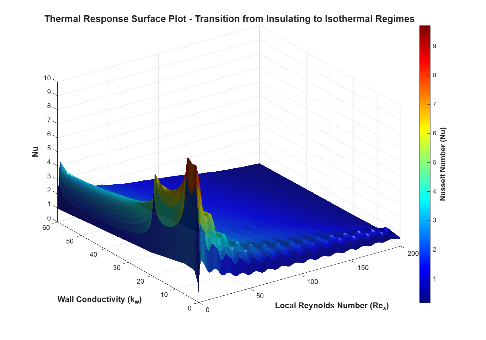
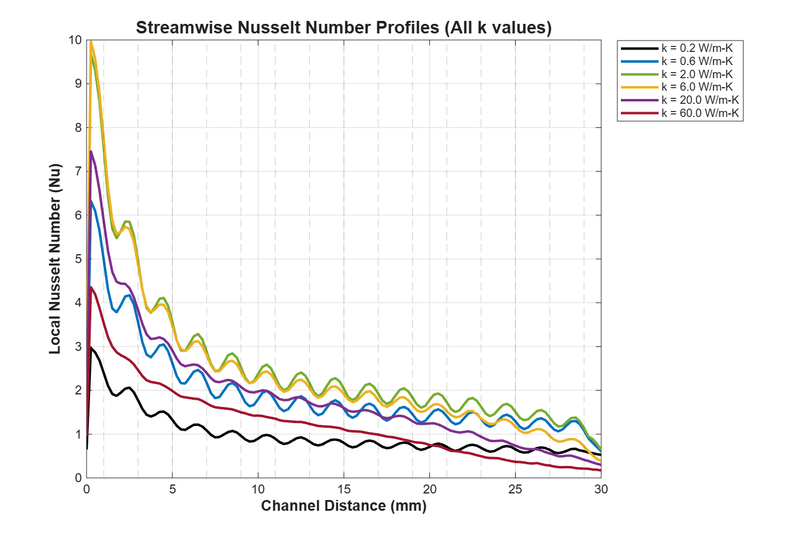
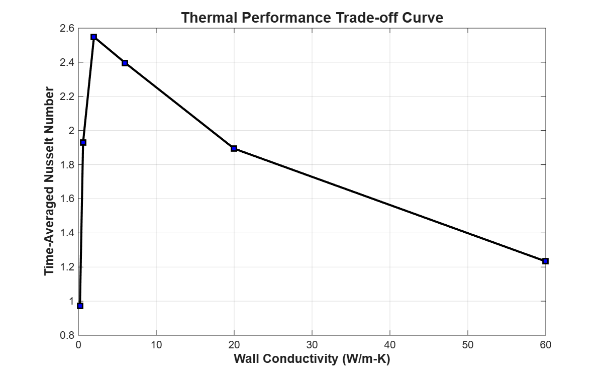
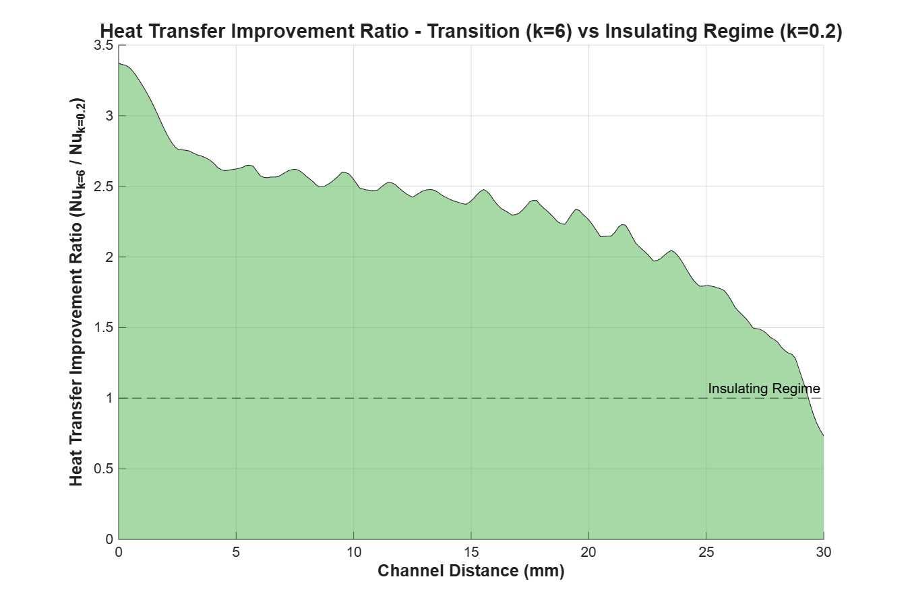

# Parametric Analysis of Wall Thermal Conductivity on the Performance of Segmented Microchannel Methanol Steam Reformers

<p align="center">

</p>

This project implements a parametric analysis of wall thermal conductivity on the operational stability of methanol steam reforming reactors. By using CFD simulation datasets, the study quantifies the transition from thermally unstable to isothermal regimes. The analysis identifies a **critical transition threshold at $k_w \approx 6.0$** W/m-K and establishes an optimal engineering design range of **$6.0 < k_w < 20.0$** W/m-K, offering a **3.3-fold increase in heat transfer efficiency** at the critical reactor inlet.

## 📌 Project Overview

In microchannel reactors, flow instabilities and thermal oscillations often caused by segmented catalyst designs, pose significant risks to reactor integrity and conversion efficiency. Insulating materials fail to dissipate the high heat flux generated by exothermic oxidation segments, leading to dangerous hot spots.

This study looks into these challenges by analyzing the **Local Nusselt Number ($Nu_x$)** across the reactor length. By mapping the thermal landscape, the system identifies the precise material properties required to dampen these oscillations and ensure safe, isothermal operation.

## 🛠️ Technology Used

* **Simulation Data:** ANSYS FLUENT (Steady-state, Laminar Regime)
* **Numerical Analysis:** MATLAB (Interpolation, Statistical Windowing)
* **Data Science:** Feature Scaling ($Re_x$), Curve Fitting
* **Visualization:** MATLAB Graphics (3D Surface Plots)
* **Dataset:** [Mendeley Data: Effect of wall thermal conductivity on the dimensionless Nusselt number of microchannel steam reforming reactors with oxidation catalyst segments (Chen, 2022)](https://doi.org/10.17632/7r9thv76z7.1)

## 🔳 Key Features

* **Physics-Informed Feature Engineering:** Transforms raw streamwise distance ($x$) into the **Local Reynolds Number ($Re_x$)**, allowing for generalized analysis across different flow rates in the laminar region ($Re = 200$).
* **Thermal Regime Mapping:** classifies wall materials into **Insulating**, **Transition**, or **Conducting** regimes based on their ability to suppress Nusselt number fluctuations.
* **Segmentation Grid Analysis:** Correlates thermal spikes directly with the **1mm active catalyst / 1mm spacing zone** geometry to visualize heat localization.
* **Optimization Analysis:** Calculates the **Performance Saturation Point** ($k \approx 20$) to determine the exact wall conductivity where thermal performance begin to drop significantly, preventing over-engineering.

## 📁 Repository Structure

<pre>
├── data
│   └── combined_nusselt_data.csv 
├── results
│   ├── 3D_Surface_Plot.png   
│   ├── Regime_Profiles_All.png
│   ├── Thermal_Performance_Curve.png
│   └── Heat_Transfer_Improvement.png
│   ├── microchannel_analysis.m
├── LICENSE
└── README.md
</pre>

## 🚀 Getting Started

### 1. Clone the Repository

```bash
git clone https://github.com/Oluwatobi-coder/Microchannel-Thermal-Analysis.git
cd Microchannel-Thermal-Analysis

```

### 2. Run the Analysis

Open MATLAB, navigate to the repo folder, and run the main `microchannel_analysis` script:

```matlab
>> microchannel_analysis

```

* The script will load the data, calculate the scaling factors, and generate all 4 visualization figures automatically.
* Results will be saved to the `results/` folder.

## 📊 Results

The analysis revealed a non-linear relationship between wall conductivity and thermal stability. The transition regime was successfully identified, where performance gains are maximized before hitting the boundary layer limit.

<p align="center">

</p>

### Performance Insights

<p align="center">


</p>

## 🤝 Contributing

Contributions are welcome! Potential improvements include:

* Extending the analysis to turbulent flow regimes.
* Adding a Python/Matplotlib implementation of the plotting scripts.

## 📚 References

* Bergman, T. L., Lavine, A. S., Incropera, F. P., & DeWitt, D. P. (2011). *Fundamentals of Heat and Mass Transfer*. John Wiley & Sons.
* Chen, J. (2022). "Effect of wall thermal conductivity on the dimensionless Nusselt number of microchannel steam reforming reactors with oxidation catalyst segments," *Mendeley Data*, V1. doi: 10.17632/7r9thv76z7.1
* Rohsenow, W. M., Hartnett, J. P., & Cho, Y. I. (1998). Handbook of Heat Transfer. McGraw-Hill.

## 📜 License

This project is licensed under the MIT License - see the `LICENSE` file for details.

If you find this analysis framework useful, please ⭐ the repository!
